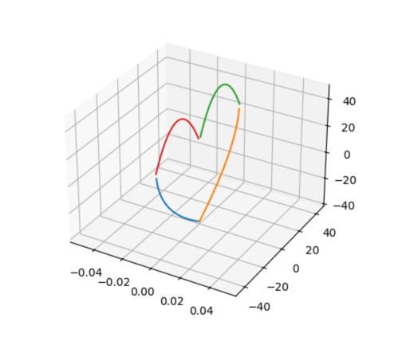
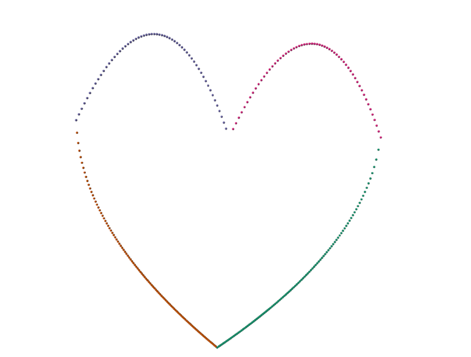

# MolecularCanvas

"Draw" nonsensical polypeptides for superfluous reasons.
This is a very buggy joke project I did in a few hours.
It is not supported and I will not fix any issues.

## Installation

1. Clone the repo
2. Install dependencies with `pip install -r requirements.txt`
3. Enjoy!

## Example Usage

```python
from MolecularCanvas.canvas import Canvas

canvas = Canvas()

# Define main heart shape parameters
diff = 20
verts = 200
width_1 = 84
height_1 = 60
center_z = -10

# Draw the upper heart curves
canvas.draw_function(
    "sqrt(1-x)",
    center=(0, -diff - 22, center_z),
    num_vertices=verts,
    orientation=(0, 0, -1),
    width=width_1,
    height=height_1,
)

canvas.draw_function(
    "sqrt(1+x)",
    center=(0, diff + 22, center_z),
    num_vertices=verts,
    orientation=(0, 0, -1),
    width=width_1,
    height=height_1,
)

# Define lower heart shape parameters
p2_verts = 60
width_2 = 42
diff_2 = 22
height_2 = 25
center_h2 = 36

# Draw the lower heart curves
for direction in [diff_2, -diff_2]:
    canvas.draw_function(
        "x**2",
        center=(0, direction, center_h2),
        num_vertices=p2_verts,
        orientation=(0, 0, -1),
        width=width_2,
        height=height_2,
    )

# Display and save the molecular structure
canvas.show()
canvas.save(name="02/14", output_path="./outputs/0214.pdb", scale=0.1, orientation=(-90, 0, 0))
```

## Example Output (Matplotlib)



## Example Output (RCSB 3d View)



## Example Output (Nanome VR)


## Example Output (running ./MolecularCanvas/paint.py)

